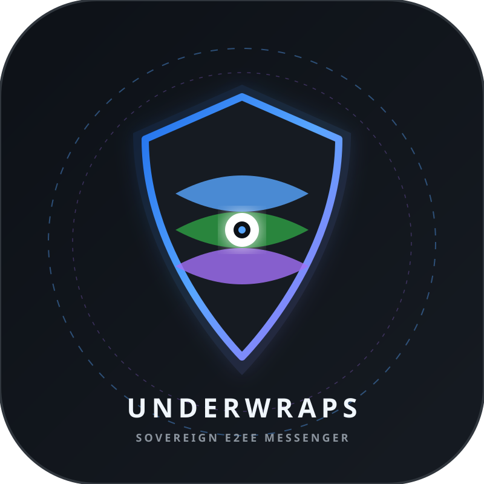

# 🔮 UnderWraps Private Messenger (v1.0.0)

  

  <strong>Zero-Friction Private Messenger with End-to-End Encryption, Sound-Reactive Themes & Cryptographic Halos</strong>

  
  
  
  

---

## ✨ Features & Shocking Innovations

* ⚡ **Zero-Configuration Connection**: Clients automatically discover and connect to your UnderWraps server across the local network using a background UDP beacon (8088) or localhost probe. **Zero typing of IP addresses or URLs required.**
* 🔑 **Minimalist Pure Sign-Up**: Register in 2 seconds with only **Username** and **Password**. No email verification or phone numbers needed.
* 🚀 **Zero-Click Instant Re-Entry**: Automatic session resume from encrypted local storage upon re-launching the app.
* 🌌 **3 Live Sound-Reactive Shader Themes**:
  1. **Dark Galaxy Field**: Deep cosmic starfield drifting in 3D parallax.
  2. **Inverted Stars**: Crisp high-contrast celestial space.
  3. **Cyber Aurora Matrix**: Flowing northern-lights plasma ribbons with harmonic warp oscillations.
  * *Live Voice Reactivity*: Starfield velocity, gravitational waves, and aurora plasma ribbon harmonics pulse in real-time to the amplitude of voice notes and 48kHz voice calls.
* 🌈 **Cryptographic Peer Color Halo**: Deterministic mathematical conversion of each peer's cryptographic public key into a unique glowing ambient gradient halo around their avatar. Visually distinguish contacts with cryptographic certainty.
* 🧠 **100% On-Device Neural Semantic Search**: 128-dimensional vector indexing allows natural language queries across encrypted local chat history with zero cloud leakage.
* 🛡️ **150MB Media Ceiling**: Send lossless audio, high-resolution photos, 4K clips, and documents up to 150MB with instant preview and FileGuard protection.
* 🎙️ **48kHz Hi-Fi Voice Calling & Crystal Notes**: WebRTC mesh voice calling with DSP dynamic range compression and real-time audio waveform visualizers.

---

## 📦 Client Downloads & Installation

| Platform | Format | Binary / Package | SHA-256 Hash |
| :--- | :--- | :--- | :--- |
| **Windows 10 / 11** | Standalone .exe | [dist/UnderWraps.exe](dist/UnderWraps.exe) | 5A8EC67F2BAD9F8F1D44A2AE424A135818B5CBB76905B1E4AE82FA57778DBE5B |
| **Android (7.0 - 15)** | Android .apk | [dist/UnderWraps.apk](dist/UnderWraps.apk) | 69497A9A76F9C64E74542FAE45D9A9A45A5CC95A8556CE900A1A5F1ADCD814A7 |
| **Web Browser / PWA** | Web Application | [web/index.html](web/index.html) | Modern Browser / PWA |

---

## 🚀 How to Use (3 Simple Steps)

1. **Host Starts Server**:
   * Host runs the server from the dedicated repository: [**UnderWrapsServer**](https://github.com/Alu6hel/UnderWrapsServer.git).
2. **Users Launch App**:
   * Open UnderWraps.exe (Windows) or install UnderWraps.apk (Android) or open web/index.html.
   * The app silently auto-detects the server within <100ms.
   * Type **Username** and **Password** -> Click **Create Account**.
3. **Chat & Call**:
   * Click **+ New DM**, select your peer's @username, and start texting or voice calling immediately!

---

## 🌐 Server Repository
The dedicated private server engine, Docker container, and server GUI dashboard are hosted separately at:
🔗 **[https://github.com/Alu6hel/UnderWrapsServer.git](https://github.com/Alu6hel/UnderWrapsServer.git)**

---

## 🧪 Automated Testing

Run the client test suite:
`ash
python test_all.py
`
